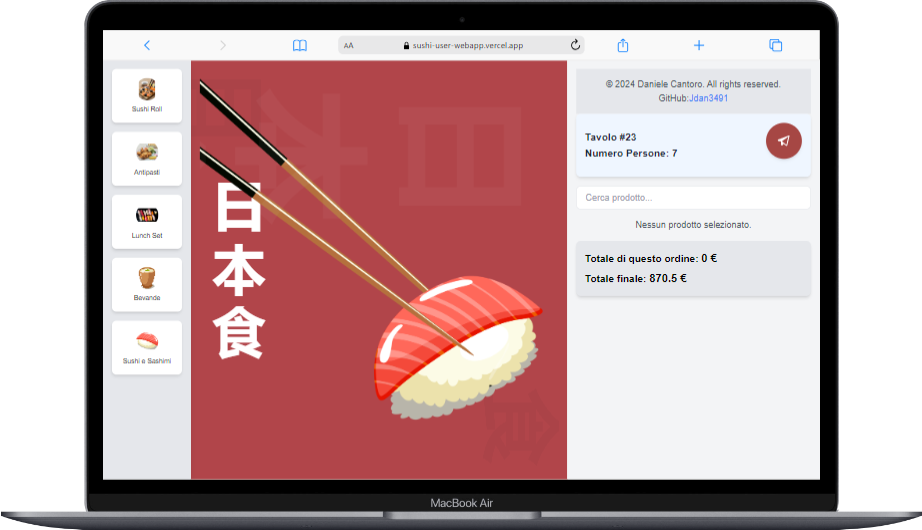

# sushi_user_webapp_

## Descrizione del Progetto

**sushi_user_webapp_** è una web app progettata per migliorare l'esperienza di ordinazione dei clienti in un ristorante. Utilizzando un QR Code presente sui tavoli, i clienti possono accedere al menu digitale interattivo, personalizzare i loro ordini e pagare direttamente online. Il sistema garantisce un flusso di lavoro semplificato sia per i clienti che per il personale del ristorante, con notifiche in tempo reale e gestione automatizzata degli ordini.

### Funzionalità Principali

- **Accesso tramite QR Code**: I clienti scansionano il QR Code presente sul tavolo per accedere al menu specifico del loro tavolo.
- **Menu Interattivo**: Visualizzazione dei piatti suddivisi per categoria, con dettagli sugli ingredienti, allergeni e prezzi.
- **Creazione e Personalizzazione degli Ordini**: I clienti possono selezionare i piatti, aggiungerli al carrello e personalizzare ogni ordine secondo le proprie preferenze.
- **Monitoraggio dell'Ordine in Tempo Reale**: I clienti possono visualizzare lo stato dell'ordine e ricevere aggiornamenti in tempo reale.
- **Pagamenti Sicuri Online**: Pagamenti rapidi e sicuri tramite sistemi come **Stripe** e **PayPal**.
- **Supporto Offline tramite PWA**: Accesso al menu anche in modalità offline, grazie alle funzionalità PWA.

### Tecnologie Utilizzate

- **Frontend**: React.js, HTML5, CSS3, JavaScript
- **Backend**: Firebase Cloud Functions, Firestore (NoSQL)
- **Database**: Firestore per la gestione in tempo reale dei dati.
- **Sicurezza**: HTTPS, SSL/TLS per garantire la protezione dei dati sensibili.
- **Supporto Offline**: PWA (Progressive Web App) per la navigazione limitata anche senza connessione.

## Installazione e Setup

Segui questi passaggi per configurare il progetto localmente:

1. Clona il repository:
   ```bash
   git clone https://github.com/tuo-progetto/sushi_user_webapp_.git
   cd sushi_user_webapp_
   npm install


L'app sarà disponibile su http://localhost:3000/.

Screenshot del Progetto
### Schermata di Accesso al Tavolo (QR Code)


### Menu Interattivo su Macbook
.png)

### Creazione Ordine
.png)

### Monitoraggio Ordine su Macbook
.png)

### Pagamento Online su iPhone 12 PRO MAX
.png)

### Monitoraggio Ordine su iPhone 12 PRO MAX
.png)


### Dettagli importanti:
1. La struttura delle cartelle e le dipendenze sono descritte.
2. Ho incluso immagini rappresentative per il README, utilizzando la cartella `documents` per gli screenshot.
3. La sezione di installazione fornisce una guida chiara per l'installazione del progetto localmente.
